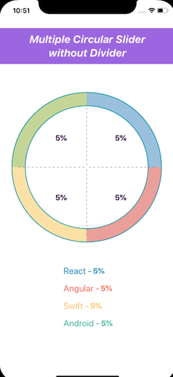

[]()
[]()
[](https://www.npmjs.com/package/react-native-circular-multiple-slider)

# react-native-circular-multiple-slider

React Native component for circular multiple slider and pie chart.

## Example app:

It's an example with this package

&nbsp;&nbsp;&nbsp;&nbsp;&nbsp;&nbsp;&nbsp;&nbsp;&nbsp;


&nbsp;&nbsp;&nbsp;&nbsp;&nbsp;&nbsp;&nbsp;&nbsp;&nbsp;


&nbsp;&nbsp;&nbsp;&nbsp;&nbsp;&nbsp;&nbsp;&nbsp;
&nbsp;&nbsp;&nbsp;&nbsp;&nbsp;&nbsp;&nbsp;&nbsp;


## Features:

- Slider with Circle Divider
- Slider with Square Divider
- Slider with Bar Divider
- Slider with Icon Divider
- Slider with Text Divider Component
- Slider without Divider
- PieChart with Text Divider Component
- PieChart with Icon Divider Component

## Installation

1. Install library and react-native-svg

   `npm i --save react-native-circular-multiple-slider react-native-svg@9.7.1`

2. Link native code for SVG

   `react-native link react-native-svg`

   and install cocoapods in the ios project

   `pod install`

## Usage

Import Circular Multiple Slider

```js
import CircularSlider from 'react-native-circular-multiple-slider';
```

Use as follows:

```jsx
<CircularMultipleSlider
  componentType={'slider'} //Default type is slider
  values={this.state.value}
  colors={['#9BBFE0', '#E8A09A', '#FBE29F', '#C6D68F']}
  onUpdate={this.onUpdate}
  dividerComponent={[
    this.getDividerComponentImage(REACT_IMAGE),
    this.getDividerComponentImage(ANGULAR_IMAGE),
    this.getDividerComponentImage(SWIFT_IMAGE),
    this.getDividerComponentImage(ANDROID_IMAGE),
  ]}
  dividerComponentSize={DIVIDER_COMPONENT_SIZE}
  slideDividerType={'circle'}
  borderColor={'#0088a0'}
  borderWidth={3}
  strokeWidth={30}
  radius={160}
  separatorColor="#171717"
  minimumStopValue={0.5}
/>
```

## Configuration

You can configure the passing by following props:

### Props

- [`style`](#style)
- [`values`](#values)
- [`colors`](#colors)
- [`onUpdate`](#onupdate)
- [`componentType`](#componentype)
- [`dividerComponent`](#dividercomponent)
- [`dividerComponentSize`](#dividercomponentsize)
- [`minimumStopValue`](#minimumstopvalue)
- [`slideDividerType`](#slidedividertype)
- [`slideDividerIcon`](#slidedividericon)
- [`hideSlideDividerType`](#hideslidedividertype)
- [`onPanResponderGrant`](#onpanrespondergrant)
- [`onPanResponderRelease`](#onpanresponderrelease)
- [`borderWidth`](#borderwidth)
- [`strokeWidth`](#strokewidth)
- [`radius`](#radius)
- [`separatorColor`](#separatorcolor)

---

### Methods

- [`updateValues`](#updatevalues)

---

### `style`

Used to style and layout the `Multiple Circular Slider`. See `StyleSheet.js` and `ViewStylePropTypes.js` for more info.

| Type       | Required |
| ---------- | -------- |
| View.style | No       |

---

### `values`

values is a mandatory prop. This an array of values which used to render the pie chart or multiple circular slider.

| Type  | Required | Platform     |
| ----- | -------- | ------------ |
| array | Yes      | iOS, Android |

---

### `colors`

colors is a mandatory prop. This an array of colors which used to apply the color for the pie chart or multiple circular slider.

| Type  | Required | Platform     |
| ----- | -------- | ------------ |
| array | Yes      | iOS, Android |

---

### `onUpdate`

onUpdate is an prop method, used to handle the updated callback for this multiple circular slider component.

| Type | Required | Platform     |
| ---- | -------- | ------------ |
| func | Yes      | iOS, Android |

---

### `componentType`

componentType is a type, which will decide wheather it is pie-chart or multiple circular slider component.

| Type   | Required | Values            | Default Value | Platform     |
| ------ | -------- | ----------------- | ------------- | ------------ |
| string | No       | Slider, Pie_Chart | Slider        | iOS, Android |

---

### `dividerComponent`

dividerComponent is array of component, which used to render between the divider portions.

| Type  | Required | Platform     |
| ----- | -------- | ------------ |
| array | No       | iOS, Android |

---

### `dividerComponentSize`

dividerComponent is size of component, which is the size of the component rendered between the divider portions.

| Type   | Required | Default Value | Platform     |
| ------ | -------- | ------------- | ------------ |
| number | No       | 50            | iOS, Android |

---

### `minimumStopValue`

minimumStopValue is value of the divider progress can move until this minimum value.

| Type   | Required | Default Value | Platform     |
| ------ | -------- | ------------- | ------------ |
| number | No       | 1             | iOS, Android |

---

### `slideDividerType`

slideDividerType is a type, which will decide the type of the slide divider.

| Type   | Required | Values                    | Default Value | Platform     |
| ------ | -------- | ------------------------- | ------------- | ------------ |
| string | No       | Circle, Square, Bar, Icon | Circle        | iOS, Android |

---

### `slideDividerIcon`

slideDividerIcon is the icon used for the slideDivider, if the slideDividerType is icon.
| Type | Required | Platform |
| ---- | -------- | -------- |
| any | No | iOS, Android |

---

### `hideSlideDividerType`

hideSlideDividerType will decide the visibility of the SlideDivider

| Type | Required | Values      | Default Value | Platform     |
| ---- | -------- | ----------- | ------------- | ------------ |
| bool | No       | false, true | false         | iOS, Android |

---

### `onPanResponderGrant`

onPanResponderGrant is an prop method, used to handle the slider grant callback, this method will get called whenever the slider starts sliding.

| Type | Required | Platform     |
| ---- | -------- | ------------ |
| func | Yes      | iOS, Android |

---

### `onPanResponderRelease`

onPanResponderRelease is an prop method, used to handle the slider release callback, this method will get called whenever the slider release from the sliding.

| Type | Required | Platform     |
| ---- | -------- | ------------ |
| func | Yes      | iOS, Android |

---

### `borderColor`

borderColor is the color for the border.
| Type | Required | Platform |
| ---- | -------- | -------- |
| string | No | iOS, Android |

---

### `borderWidth`

borderWidth is the width of the border.

| Type   | Required | Default Value | Platform     |
| ------ | -------- | ------------- | ------------ |
| number | No       | 3             | iOS, Android |

---

### `strokeWidth`

strokeWidth is the width of the stroke for the pie-chart or circular multiple slider.

| Type   | Required | Default Value | Platform     |
| ------ | -------- | ------------- | ------------ |
| number | No       | 30            | iOS, Android |

---

### `radius`

radius is the radius for the pie-chart or circular multiple slider.

| Type   | Required | Default Value | Platform     |
| ------ | -------- | ------------- | ------------ |
| number | No       | 120           | iOS, Android |

---

### `separatorColor`

separatorColor is the separator color for the slider arc of the pie-chart or circular multiple slider.

| Type   | Required | Default Value | Platform     |
| ------ | -------- | ------------- | ------------ |
| string | No       | #171717       | iOS, Android |

---

## Methods

### `updateValues`

updateValues is the method in this package which can be used to update the values at run time by accessing via reference of the pie-chart or circular multiple slider.

## Parameter

- values - This an array of values which used to render the pie chart or multiple circular slider.

| Type | Parameters | Platform     |
| ---- | ---------- | ------------ |
| func | values     | iOS, Android |

## Working with example app

### With XCode

You'll find working example in the `example` directory of this repository. You can run it by:

```sh
git clone https://github.com/ibrahimsulai/react-native-circular-multiple-slider.git
cd  react-native-circular-multiple-slider/app/example/react_native_circular_multiple_slider_example
npm install
open ios/react_native_circular_multiple_slider_example.xcworkspace
```

XCode will open. Click Run button and that's it.

## Author

Ibrahim Sulaiman (ibrahim.kce@icloud.com)

## License

The library is released under the MIT licence. For more information see `LICENSE`.
